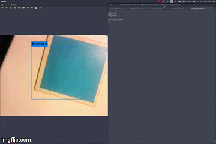

# BraccioPlayMemory



## Getting started
* Install <http://wiki.ros.org/kinetic>
* Flash an Arduino Uno with the Arduino code
* Run 
```
$ catkin_make
``` 
in the /catkin_ws folder
* If everything is installed correctly, open 5 terminals
* Source the workspace in every terminal
```
source devel/setup.bash
```
* Terminal 1: 
```
$ roscore
```
* Terminal 2: Use usb\_cam to publish webcam images, darknet\_ros would subscribe it to
```
$ roslaunch usb_cam usb_cam-test.launch
```
* Terminal 3: Start YOLOv2 object detection
```
$ roslaunch darknet_ros Braccio_darknet_ros.launch
```
* Terminal 4: Transfer output from YOLOv2 into robot instruction
```
$ rosrun detect_and_collect parse_and_publish
```
* Terminal 5: Connect to Arduino via serial connection
```
$ rosrun rosserial_python serial_node.py /dev/ttyACM0
```

## Our work: 
* Configuration of the network in /darknet/cfg/yolo-obj.cfg
* Dataset and labels in /darknet/data/obj
* ROS code in /catkin_ws/src/detect\_and\_collect
* Code on the Arduino in /Arduino/braccio\_ros/braccio\_ros.ino
* Final weights in /darknet/TrainingTinyTiny/yolo-obj-1500.weights


## Work of others
* [Labeling Tool](https://github.com/puzzledqs/BBox-Label-Tool)
* [Visualization Tool](https://github.com/mrzl/ofxDarknet)
* [YOLO](https://pjreddie.com/darknet/yolo/)
* [Darknet](https://github.com/pjreddie/darknet)
	
